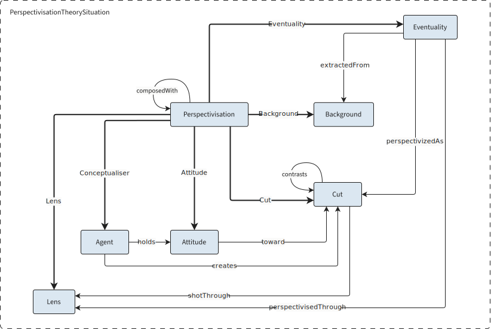

---
description:
subtitle: Our design choices
icon: octicons/ai-model-16
---

In engaging with reality, a subject must inevitably conceptualize it, adopting a viewpoint that reflects their subjectivity. Cognitive linguistics argues that such perspectivization process underlies the production of meaning and entails authorial responsibility in discourse: a viewpoint is the cognitive mechanism by which a speaker (or conceptualizer) *construes* an event or situation [@Verhagen2007].

At the core of **cognitive perspectivization** is the subject actively construing a perceived, evaluated, negated, or inferred situation. Because this process is inherently subjective, the same occurrence can be conceptualized in multiple, sometimes conflicting ways. This contrastive dimension becomes especially salient in argumentative contexts.

We therefore treat argumentation as a special case of perspectivization, governed by specific logical constraints.

## Methodology

Building an ontology is a complex operation since it is intended to be set in context. It is necessary to understand how to reuse or repurpose pre-existing ontologies and translate non-ontological modeling and nonformal resources into description logic.
We followed NeOn methodology [@Suárez-Figueroa2012].
Mixed scenario of non-ontological resource re-enegeering, and reuse of ontology design patterns (ODPs) and ontological resources.

1. Requirement specification (competency questions CQs)
2. Selection of non-ontological resources and reverse engeneering
3. Ontology selection for reuse and restructuring
4. Alignment
4. Conceptualization
5. Formalization
6. Implementation

These steps need to be taken iteratively as in our case we were adapting a non-monotonic and closed-world framework to a monotonic and open-world language (OWL).

## Perspectivisation

!!! info inline end "Eventuality"
	
	In the DOLCE foundational ontology, “eventuality” is an umbrella term encompassing events, activities, event types, and situations (configurations that provide a setting for multiple entities) used to abstract from formal distinctions among them.

The *Perspectivisation Ontology Design Pattern* (ODP), introduced in [@Gangemi2022], models the conceptual "cuts" a subject makes on an eventuality through the lenses (conscious or unconscious) available to them. Just as a filmmaker frames reality through a camera lens, a subject construes an eventuality through their own preconceptions, beliefs and values. The result is a **composition** of the eventuality and the conceptualiser’s lens: a cut that is conveyed in the subject’s expressions and may conflict with representations produced by other agents.

This perspectivisation situation is modeled as an *n-ary relation* that links the conceptualiser, the eventuality, the background knowledge from which the eventuality is extracted, the lens through which it is construed, the resulting cut, and the conceptualiser's attitude toward that cut.

<!-- Come non citare poi grandi campioni come l'Agent e l'Attitude che rompon di brutto i coglioni (leggi che metrica sto periodo) -->

<figcaption>Perspectivisation Model</figcaption>

## Argumentation

### Adapting ASPIC^+^ structures
Since our focus is capturing the notion of argumentation in real-world contexts, we considered the features of the framework that represent defeasible reasoning, leaving aside those dedicated to strictly deductive reasoning. Moreover, since our main objective was to represent the structure of argumentation, we did not implement the preference mechanism to establish the winner argument. This could be integrated in the future.

### Limitations of OWL DL

- OWA:
	- Conceded arguments are equated with the not-yet-attacked arguments.
	- it is necessary to explicitly mark up atomic propositions to distinguish them from statements that represent inference rules.
	- The reasoner cannot make inferences about non-explicit negations.

- Monotonic

### Conflict schemes

## CONTRO

| Persp             | Arg            |
|-------------------|----------------|
| Perspectivisation | Argument       |
| Lens              | Premise        |
| Cut               | Conclusion     |
| Background        | Knowledge Base |

## Descriptions and situations
