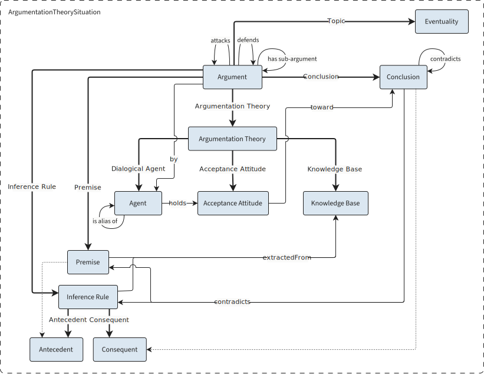

In engaging with reality, a subject must inevitably conceptualize it, adopting a viewpoint that reflects their subjectivity. Cognitive linguistics argues that such perspectivisation process underlies the production of meaning and entails authorial responsibility in discourse: a viewpoint is the cognitive mechanism by which a speaker (or conceptualizer) *construes* an event or situation [@Verhagen2007].

At the core of **cognitive perspectivisation** is the subject actively construing a perceived, evaluated, negated, or inferred situation. Because this process is inherently subjective, the same occurrence can be conceptualized in multiple, sometimes conflicting ways. This contrastive dimension becomes especially salient in argumentative contexts.

We therefore treat argumentation as a **special case of perspectivisation**, subject to additional logical constraints. Achieving compatibility between the two models is significant not only because their key elements can be mapped to one another, but also because each model deepens the relationships among them with **complementary focuses**.

Perspectivisation theory accounts for the **persistence of an agent's internal point of view** in their conception of external facts through a mechanism of compositionality. It focuses on the interaction between an occurrence and the agent's lens, which are blended in the concept the agent forms of the situation, shaping the meaning conveyed in discourse.

Argumentation theory, by contrast, offers a finer account of **how an agent accesses their preconceptions**, which serve as tools for both interpreting and expressing a fact. It explicitly distinguishes the core components of argumentation (premises, inference rule, conclusion) from the factors that enable argument production (dialogical agent, acceptance attitude, knowledge base), grouping these within an intermediate structure (the agent's internal argumentation theory). This model clarifies an aspect absent in perspectivisation: the relation between background and lens, that is, between the knowledge base and the premises and inference rules derivable from it. It leaves out, however, how the opinion on the topic expressed in the conclusion comes to form **a new blended entity**, merely making it available as support for further argumentation. Finally, argumentation theory **qualifies the nature of contrast**, extending it beyond conflicts between conclusions to allow for oppositions in which a conclusion targets the support (premise or inference rule) of another argument.

## Methodology

Building an ontology is complex, as its value depends on the context it supports. The design should not only satisfy the requirements, but also prioritize modularity, reusability, and compatibility [@Suárez-Figueroa2012].

### Requirements

#### Non-Functional

Our primary goal was to develop an ontology capable of supporting **Natural Language Understanding (NLU)** in the representation of complex human phenomena like controversies. Contemporary NLU systems increasingly incorporate symbolic reasoning and structured knowledge into machine learning pipelines, which makes ontologies, semantic networks, and rule-based formalisms highly relevant. A key design requirement, therefore, was that ontology population should require **minimal human annotation** so that it might be carried out by automated agents. This was addressed through the strategic use of property chains, enabling inference via the [HermiT reasoner](http://www.hermit-reasoner.com/).

Additionally, we aimed for the ontology to be useful to researchers involved in text analysis. One potential application is its integration as an annotation layer within **TEI-based scholarly editions**, facilitating the reconstruction of argumentative structures in the text. By linking related sub-arguments, the ontology may render an **outline of argumentation trees** grounded in the document's logical architecture. This use case is illustrated in the annotated excerpts provided in the [Examples](examples.md) section.

#### Functional (Competency Questions)

We now reconsider the questions raised initially and reformulate them in light of the categories of both perspectivisation and argumentation theory.

Given a dialogical agent: 

- ***How is their argumentative style characterized?***

    The ontology should return their `Acceptance Attitude`.

- ***What kinds of attacks do they tend to favor?***

    The ontology should list their `Undercuts`, `Rebuttals` and `Underminings` by frequency.

- ***What reasons do they put forward during argumentation?***

    The ontology should return their `Premises` that are not derived from other `Arguments`.

- ***What is their final opinion?***

    The ontology should return their `Conclusions` that are not used as `Premises` in other `Arguments`.

- ***How are these reasons reflected in their view of the issue at stake?***

    The ontology should return...


We also define the questions the ontology is not designed to answer (negative competency questions), due to limitations in representational scope or the reasoning capabilities of OWL DL.

- ***What reasons are implicit in the agent’s arguments?***

    The ontology can only represent arguments whose components are explicitly provided or inferable from existing structure. Since OWL reasoning is monotonic and cannot introduce new individuals, it cannot generate implicit reasons—only deduce the consequences of those already declared. Any reasoning about unstated premises would require abductive mechanisms beyond standard DL reasoning.

- ***What implicit opinions are attributed to the agent by the opponent?***

    In the current model, authorship is assigned to arguments, not to the statements (premises or conclusions) that compose them. This reflects the assumption that individual propositions may be shared between interlocutors, particularly when both accept them. As a result, the ontology does not encode attribution of specific statements to particular agents outside the argumentative context.

- ***What assertions are retracted?***
    
    Tracking retractions requires the ability to represent change over time, for example to distinguish between earlier and later states of belief or commitment. Such diachronic modeling is not supported by ASPIC^+^ and cannot be naturally encoded within OWL DL, which lacks native temporal constructs and non-monotonic reasoning capabilities.

### Reuse and adaptation

Ontology development frequently involves reusing or adapting existing ontologies, as well as translating non-ontological models and informal resources into formal representations. In the case of CONTRO, this included both the adaptation of formal but non-ontological frameworks like ASPIC^+^ to the constraints of Description Logic, and the reuse of ontology design patterns, such as the Perspectivisation Ontology Design Pattern (ODP). Additionally, components were integrated from established ontologies, namely **DOLCE**.

DOLCE serves a dual role within the ontology. First, its Eventuality and Agent classes provide **ontological entry points** for grounding discourse entities in real-world referents. Second, its *Descriptions and Situations framework (DnS)* offers a structural basis for modeling perspectivisation and argumentative configurations as situation descriptions. This layer of abstraction enables compatibility with a range of domain ontologies, supporting flexible integration.

In DnS, *binary relations* are usually modeled as **roles** and *n-ary relations* as **situations satisfying descriptions**. We assigned roles to the entities outside the scope of our domain: for example, an eventuality may function as the topic of a perspective, while an agent will act as a dialogical agent within an argumentative exchange. On the other hand, descriptions capture the formal structure of the configuration, that is, the theoretical model of how components such as premises, conclusions, and agents relate within a given argumentative situation.

Because we model n-ary relations, relying on domain and range constraints alone to define class membership would be inadequate. Argumentative situations require the presence of multiple essential components to be semantically well-formed. For instance, an entity that includes only premises would not qualify as an argument unless it also contains a conclusion and an inferential relation linking them. Therefore, **class-level equivalence axioms**, and not property domains and ranges, are the primary mechanism for **type recognition** in the ontology.

The resulting Argumentation and Perspectivisation modules are **self-contained** and **usable independently**. However, when integrated within CONTRO, they yield a unified framework that generalizes perspectives from argumentative structures. In this sense, CONTRO functions fundamentally as an **alignment tool**, facilitating interoperability across different representations of controversial discourse.


## Perspectivisation

!!! info inline end "Eventuality"
    
    In the DOLCE foundational ontology, “eventuality” is an umbrella term encompassing events, activities, event types, and situations (configurations that provide a setting for multiple entities) used to abstract from formal distinctions among them.

The *Perspectivisation Ontology Design Pattern* (ODP), introduced in [@Gangemi2022], models the conceptual "cuts" a subject makes on an eventuality through the lenses (conscious or unconscious) available to them. Just as a filmmaker frames reality through a camera lens, a subject construes an eventuality through their own preconceptions, beliefs and values. The result is a **composition** of the eventuality and the conceptualiser’s lens: a cut that is conveyed in the subject’s expressions and may conflict with representations produced by other agents.

This perspectivisation situation is modeled as an n-ary relation that links the conceptualiser, the eventuality, the background knowledge from which the eventuality is extracted, the lens through which it is construed, the resulting cut, and the conceptualiser's attitude toward that cut. Apart from the agent who has the role of conceptualiser, all the components of the n-ary relation are also modeled as situations, that is, as further unspecified n-ary relations.

<!-- Come non citare poi grandi campioni come l'Agent e l'Attitude che rompon di brutto i coglioni (leggi che metrica sto periodo) -->

<figure class="diagram" markdown>
<figcaption>Perspectivisation Model</figcaption>

</figure>

## Argumentation

The Argumentation Ontology is a faithful adaptation of the ASPIC^+^ framework as outlined in [Background](background.md#aspic), with some adjustments and simplifications related to the expressivity constraints of OWL DL.

At the core of the model is the `Argument`, defined as a structure composed of one or more `Premises`, an `Inference Rule`, and a `Conclusion` derived from the application of the rule to the premises. Each argument is built on the basis of the internal `Argumentation Theory` of a `Dialogical Agent`, who participates in discourse according to their `Acceptance Attitude` and draws upon their `Knowledge Base` to construct arguments.

<figure class="diagram" markdown>
<figcaption>Argumentation Model</figcaption>

</figure>

Arguments can come into conflict through `attack` relations, which occur when the conclusion of one argument `contradicts` a component of another. Specifically, an argument may:

- undermine a premise,
- undercut an inference rule, or
- rebut a conclusion.

These forms of conflict are respectively called `Undermining`, `Undercut`, and `Rebuttal`.


<figure class="diagram" role="group" markdown>
<figure class="align-left" markdown>
<figcaption>Undermining</figcaption>

<p>An undermining is a conflict that attacks an argument on its premise.</p>
</figure>
<figure class="align-right" markdown>
<figcaption>Undercut</figcaption>

<p>An undercut is a conflict that attacks an argument on its inference rule.</p>
</figure>
<figure class="align-left" markdown>
<figcaption>Rebuttal</figcaption>

<p>A rebuttal is a conflict that attacks an argument on its conclusion, providing an alternative one.</p>
</figure>
</figure>

These conflict diagrams portray the arguments of the sample ontology available for download [here](https://w3id.org/contro/example.ttl).

### Adapting ASPIC^+^ structures

ASPIC^+^ is designed to construct arguments from elements of a knowledge base, our approach inverts this process: we employ ASPIC^+^ not as a a generative engine but as an **analysis tool** for interpreting argument structures already implicit in a text.

Given our focus on modeling argumentation in real-world contexts, we have opted to generalize the notions of inference rule and premise, setting aside the distinctions between strict (deductive) and defeasible rules, as well as between axiomatic and ordinary premises. In our model, **every argument is treated by default as defeasible**, and all premises as assertions subject to potential undermining.

Moreover, our interest lies in understanding differences in styles of argumentation, rather than in crowning a winner argument. For this reason, we focused on representing the structure and interaction of arguments, and did not prioritize the implementation of the preference mechanism that in ASPIC^+^ is used to resolve defeaters under Dung’s semantics.

This limitation of scope does not preclude reintroducing such features in future developments without requiring substantial changes to the current structure.

## CONTRO

| Persp             | ⊇ | Arg                            |
|-------------------|:-:|--------------------------------|
| Perspectivisation |   | Argument                       |
| Lens              |   | Premise ∪ Inference Rule       |
| Cut               |   | Conclusion                     |
| Background        |   | Knowledge Base                 |
| Attitude          |   | Acceptance Attitude            |

## Tests

The easier way to test CQs is by using [Protégé](https://protege.stanford.edu): start the HermiT reasoner, export the inferred axioms as a new ontology (including class and property assertions) and run the queries in the SPARQL Queries tab.

Given an agent `x`: 

- How is their argumentative style characterized?
    ```sparql title="Return their acceptance attitude"
    SELECT ?attitude WHERE { ?x arg:holds ?attitude . }
    ```
- What kinds of attacks do they tend to favor?
    ```sparql title="List their undercuts, rebuttals and underminings by frequency"
    SELECT ?type (COUNT(DISTINCT ?conf) AS ?count)
    WHERE {
      ?conf arg:ArgumentationTheory / arg:DialogicalAgent ?x ; # (1)!
            a ?type .
      ?type rdfs:subClassOf arg:Conflict .
    }
    GROUP BY ?type
    ORDER BY DESC(?count)
    ```
    1. This sequence path selects all arguments generated by the agent's argument theory, which also contains any of their aliases. If you want to search only for authored attacks use `#!sparql ?conflict arg:by ?x`.

- What reasons do they put forward during argumentation?
    ```sparql title="Return their premises that are not derived from other arguments"
    SELECT ?prem
    WHERE {
      ?at arg:DialogicalAgent ?x ;
          arg:KnowledgeBase ?kb .
      ?kb arg:hasMember ?prem .
      ?prem a arg:Premise .
      FILTER NOT EXISTS { ?prem a arg:Conclusion }
    }
    ```

- What is their final opinion?
    ```sparql title="Return their conclusions that are not used as premises in other arguments"
    SELECT ?conc
    WHERE {
      ?x ^arg:DialogicalAgent / arg:KnowledgeBase / arg:hasMember ?conc . # (1)!
      ?conc a arg:Conclusion .
      FILTER NOT EXISTS { ?conc a arg:Premise }
    }
    ```
    1. Short form of the previous query path from a `Dialogical Agent` to the members of their `Knowledge Base`.

- How are these reasons reflected in their view of the issue at stake?
